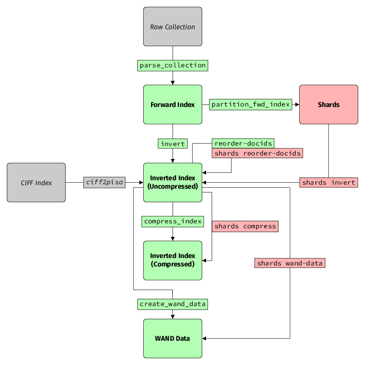

# Indexing Pipeline

This section is an overview of how to take a collection
to a state in which it can be queried.
This process is intentionally broken down into several steps,
with a bunch of independent tools performing different tasks.
This is because we want the flexibility of experimenting with each
individual step without recomputing the entire pipeline.

## External Resources

### Raw Collection

The _raw collection_ is a dataset containing the documents to index. A
collection is encoded in one of the [supported
formats](parsing.html#supported-formats) that stores a list of document
contents along with some metadata, such as URL and title. The
`parse_collection` tool takes a collection as an input and parses it to
a forward index (see [Forward Index](#forward-index)). See
[Parsing](parsing.html) for more details.

### CIFF Index

This is an inverted index in the [Common Index File Format](https://github.com/osirrc/ciff).
It can be converted to an uncompressed PISA index (more information below)
with the [`ciff2pisa`](https://github.com/pisa-engine/ciff) tool.

## Forward Index

A _forward index_ is the output of the `parse_collection` tool.
It represents each document as a list of tokens (terms) in the order of their appearance.
To learn more about parsing and the forward index format, see [Parsing](parsing.html).

## Inverted Index

An inverted index is the most fundamental structure in PISA.
For each term in the collection, it contains a list of documents the term appears in.
PISA distinguishes two types of inverted index.

### Uncompressed / Binary Collection

The uncompressed index stores document IDs and frequencies as 4-byte integers.
It is an intermediate format between forward index and compressed inverted index.
It is obtained by running `invert` on a forward index.
To learn more about inverting a forward index, see [Inverting](inverting.html).
Optionally, documents can be reordered with `reorder-docids` to obtain another
instance of uncompressed inverted index with different assignment of IDs to documents.
More on reordering can be found in [Document Reordering](document_reordering.html).

### Compressed

An uncompressed index is large and therefore before running queries, it
must be compressed with one of many available encoding methods. It is
this compressed index format that is directly used when issuing queries.
See [Compress Index](compress-index.html) to learn more.

## WAND Data

This is a special metadata file containing additional statistics used during query processing.
See [Build additional data](query_index.html#build-additional-data).

## Shards

PISA supports partitioning a forward index into subsets called _shards_.
Structures of all shards can be transformed in bulk using `shards` command line tool.
To learn more, read [Sharding](sharding.html).
