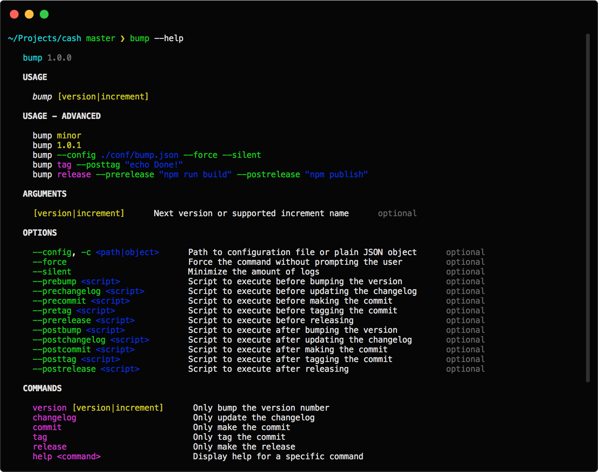

# Bump

<p align="center">
  
</p>

Bump updates the project's version, updates/creates the changelog, makes the bump commit, tags the bump commit and makes the release to GitHub. Opinionated but configurable.

## Features

Bump is here to save you time. These are all its commands, which you can also call manually individually:

- **version**: It can update your project's version, including in arbitrary files (i.e. maybe you need to write the version in the readme).
- **changelog**: It can update the changelog with the latest changes. If you don't have a changelog already it can generate one for you which includes logs about all previous versions too.
- **commit**: It can make the bump commit.
- **tag**: It can tag the bump commit.
- **release**: It can make a release to GitHub, including using the relevant section of the changelog as its description and uploading files.

Some other notable features:

- **Configurable**: Every string and what commands get executed by default can be configured via the settings.
- **Scripts**: Custom scripts can be run before/after any command.

It currently only supports Git, and it better supports JS projects. PRs for improving support of other stacks are very welcome.

## Install

```sh
npm install -g @fabiospampinato/bump
```

## Usage

Just run `bump` from inside your project. If you want to run only a specific command run `bump <command>` (i.e. `bump changelog`). If you want to learn more about the supported commands or options check out `bump --help` and `bump <command> --help`.



## Settings

Bump comes with the following default settings:

```js
{
  "force": false, // Force the command without prompting the user
  "silent": false, // Minimize the amount of logs
  "files": {}, // A map of `relativeFilePath: [regex, replacement, regexFlags?] | [regex, replacement, regexFlags?][]`
  "version": {
    "enabled": true, // Bump the version number
    "initial": "0.0.0", // Initial version
    "increments": ["major", "minor", "patch", "premajor", "preminor", "prepatch", "prerelease", "custom"] // List of available increments to pick from
  },
  "changelog": {
    "enabled": true, // Enable changelog auto-updates
    "create": false, // Create the changelog file if it doesn"t exist
    "open": true, // Open the changelog file after bumping
    "file": "CHANGELOG.md", // Name of the changelog file
    "version": "### Version [version]", // Template for the version line
    "commit": "- [message]", // Template for the commit line
    "separator": "\n" // Template for the separator between versions sections
  },
  "commit": {
    "enabled": true, // Commit the changes automatically
    "message": "Bumped version to [version]" // Template for the commit message
  },
  "tag": {
    "enabled": true, // Tag the bump commit
    "name": "v[version]" // Template for the name of the tag
  },
  "release": {
    "enabled": false, // Release to any enabled release providers
    "github": {
      "enabled": false, // Make a GitHub release
      "open": true, // Open the release/draft page
      "draft": true, // Mark it as a draft
      "prerelease": false, // Mark it as a prerelease
      "files": [], // Globs of files to attach to the release
      "token": "", // GitHub OAuth token with `public_repo` priviledge
      "owner": '', // GitHub repository owner
      "repo": '' // GitHub repository name
    }
  },
  "tokens": {
    "date": {
      "format": "YYYY-MM-DD" // Moment.js format to use when generating the `[date]` token
    },
    "version_date": {
      "format": "YYYY-MM-DD" // Moment.js format to use when generating the `[version_date]` token
    }
  },
  "scripts": {
    "prebump": "", // Script to execute before bumping the version
    "postbump": "", // Script to execute after bumping the version
    "prechangelog": "", // Script to execute before updating the changelog
    "postchangelog": "", // Script to execute after updating the changelog
    "precommit": "", // Script to execute before committing
    "postcommit": "", // Script to execute after committing
    "pretag": "", // Script to execute before tagging
    "posttag": "", // Script to execute after tagging
    "prerelease": "", // Script to execute before releasing
    "postrelease": "" // Script to execute after releasing
  }
}
```

You can override them in multiple ways:

- **Computer-level settings**: Place your computer-level settings inside `~/.bump.json` to override the default ones. You should put auth tokens here.
- **Project-level settings**: Place your project-level settings at the root of your project in a file named `bump.json`, these settings also override computer-level settings.
- **Dynamic settings**: You can pass an arbitrary settings object via the `--config` CLI option, these settings have the highest priority. Some other specific CLI options are supported too (i.e. `--silent`).
- **Environment variables**: the following environment variables are supported too: `GITHUB_TOKEN`.

Check out [cash](https://github.com/kenwheeler/cash)'s [bump.json](https://github.com/kenwheeler/cash/blob/master/bump.json) as an example.

## Enabled commands

When running `bump` without explicitly providing a command all the enabled ones are executed.

If for instance you don't want to tag your bump commits you can disable the related command by setting `tag.enabled = false`.

All commands except `release` are enabled by default, I recommed you to check if everything is correct, review the changelog manually as some commits shouldn't be put into the changelog, and then make the release manually with `bump release`.

If you want to review the changes manually, and you want to publish the release to GitHub, I recommend disabling the `tag` command, as it's already handled by GitHub and amending the bump commit would become a bit more annoying.

## Templates & Tokens

Bump uses templates for generating the strings it needs. Inside those templates you can put tokens, which will be replaced with some value.

A token has the following syntax: `[token]`, and it will be replaced with some value.

Here's a list of all the available tokens, notice that not all of them are available for every template, for instance you can only use the `[hash]` token for the changelog's commit template:

| Token            | Value                                       |
| ---------------- | ------------------------------------------- |
| `[version]`      | Version's number                            |
| `[version_date]` | Version's date                              |
| `[message]`      | Commit's message                            |
| `[date]`         | Commit's date                               |
| `[hash]`         | Commit's hash                               |
| `[hash4]`        | Commit's hash cropped to first 4 characters |
| `[hash7]`        | Commit's hash cropped to first 7 characters |
| `[hash8]`        | Commit's hash cropped to first 8 characters |
| `[author_name]`  | Author's name                               |
| `[author_email]` | Author's email                              |

## Updating arbitrary files

If you want to update the version in arbitrary files you'll have to populate the `files` setting.

For example this is what the setting may look like if you want to bump the `VERSION` key of an object inside the file `custom/file.js`:

```js
{
  "files": {
    "custom/file.js": ["'VERSION':\\s*'([^']*)'", "'VERSION': '[version]'", "i"]
  }
}
```

Basically each key defined in the `files` setting is a path relative to the root of your project, the first item in the array is what will become a regex that will match the string to replace (it's important to wrap the actual version string in a capturing block), the second item in the array is the string that will replace the matched one (notice that the `[version]` token will be substituted with the actual version) and the optional third item is the regex flags to use (the default is `gmi`).

If you need to bump more than one version in a single file, using different regexes, just provide an array of arrays instead of a single array.

## Hints

- **Commits messages**: Spend some extra seconds to write descriptive commits messages, with no extra effort you'll be improving your changelogs as well. If you're already doing this, just enjoy the extra free time!
- **Changelogs**: Changelogs are cool, if your existing project doesn't have one simply run `bump changelog` to generate it.
- **Review**: Setting `commit.enabled = false` and `changelog.open = true` allows you to review your changelog before committing it. Alternatively you can also auto-commit it, review it later, and in case amend the previous commit.
- **Scripts**: Scripts can be used for building/testing/deployments/etc. For example: a `prebump` script could be used for running tests, a `postbump` script could be used for compiling your project for production, a `postcommit` script could be used for pushing the commit to origin.

## Related

- **[vscode-bump](https://marketplace.visualstudio.com/items?itemName=fabiospampinato.vscode-bump)**: Extension for Visual Studio Code for interacting with Bump directly from your editor.

## License

MIT © Fabio Spampinato
